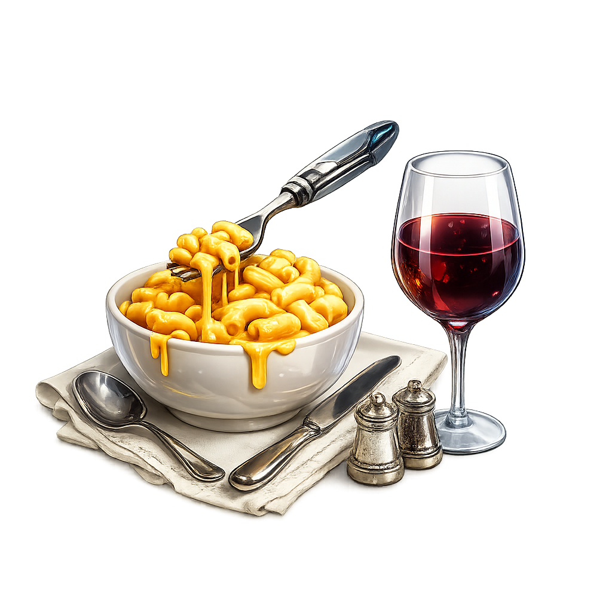

<p align="center">
  
</p>

# MacNCheese - STILL IN BETA TESTING
### Windows games on Mac, made free & easy
 The proton mac never had -no subscriptions, no paywalls, just games.

### A configurable runtime that can run steam games for free.
MacNCheese is a simple app that lets you install and play Windows games on your Mac using Wine, with all the graphics stuff (DXVK, MoltenVK,D3DMetal, DXMT…) handled automatically so you don't have to touch the terminal.

 **Need help?** Join the [Discord server](https://discord.gg/UPpVShYDaf)!

---
## Showcase 
<p align="center">
  
</p>

---
##  Quickstart Guide

### Step 1 — Before you begin: download Steam for Windows
Go to [store.steampowered.com](https://store.steampowered.com/about/) and download **SteamSetup.exe** (the Windows version). Save it to your **Downloads** folder. You'll need this later.

### Step 2 — Download & Install MacNCheese
1. Download the latest `.dmg` from the [Releases](https://github.com/mont127/MacNdCheese/releases) page
2. Open the `.dmg` file
3. Drag **MacNCheese** into your **Applications** folder
4. Open the app from Applications

### Mac says the app "can't be verified"?
That's just macOS being overprotective. Here's how to fix it:

1. Go to **System Settings** → **Privacy & Security**
2. Scroll down until you see a message about MacNCheese being blocked
3. Click **"Open Anyway"**
4. Enter your Mac password if asked
5. Open the app again — it'll work now 

### Step 3 — Install everything with one click
Once the app is open, go to settings setup and everything that there is select it and click install.

### Step 4 — Install Steam
Click the **Install Steam** / **Run installer** button. The Steam installer will pop up — go through it like normal and log into your Steam account when it asks.

>  **To open Steam Setup / Start installation later**, go to settings **Bottles* and scroll down you should see **Run installer**

### Step 5 — Install & launch your game
1. Open Steam (top of the app), find your game, and install it
2. Come back to MacNCheese — your game should appear in the list
3. Select it and hit **Launch**. Or you could **Launch from steam** to test our newest implementation **D3DMETAL**(Apples technology)

> **Not sure which backend to pick?** Just leave it on **Auto** - it'll figure it out.

---

##  FAQ

## Does Mewgenics run on macndcheese?
Yes. Startup takes about 30 seconds — give it time before assuming it's stuck. Launch Steam in silent mode, and set both the main Wine and the game's backend to the custom OpenGL Wine build.


###  What even is this?
MacNCheese is a free launcher that runs Windows games on macOS using Wine. It automatically sets up all the technical stuff (graphics translation layers, DLL overrides, etc.) so you don't have to.
### Is it free?
100% free and open source.


### Is it a replacement for Whisky?
No not at all its a one of its own architectures and is completely different steam launch you can call this "Proton that mac never had" 

### What kinds of games work best?
- DirectX 11 games (most common)
- Unity games
- DirectX 12 games (with D3DMetal)
- DirectX 9 games (Most likely to run on DXMT but mostly no)
- Games with kernel-level anti-cheat (EAC, BattlEye, Vanguard) — these will **not** work

### Why don't anti-cheat games work?
Anti-cheat software like Easy Anti-Cheat and BattlEye require deep Windows system access that wine can't provide. For few cases this is indeed a macndcheese issiue but games like marvel rivals do not work due to anticheat on every wine wrapper

### Does it work on Intel Macs?
Officially, **no** — MacNCheese is built and tested for **Apple Silicon** (M1, M2, M3, M4…). Intel Macs are not the target. You *might* get it running from source (see below), but it's not supported.

### What backend should I use?
Leave it on **Auto** and let the app decide. If you're curious:

| Backend | Use it for |
|---|---|
| **DXVK** | Most DirectX 10/11 games |
| **VKD3D-Proton** | DirectX 12 games | (STILL BEING WORKED ON AND WILL BE RENAMED TO MoltenVKD3D-proton (Aka MVKD3D-P)
| **GPTK(Launching from steam)** | DirectX 11/12 games|
| **DXMT** | Experimental DX11 via Metal (bleeding edge) |

Mesa has been removed as an auto-detected/selectable backend — the DXMT/DXVK/D3DMetal engine covers what it used to.

### My game says "DirectX 11 not available"
The graphics backend didn't load properly. Try:
1. Making sure Wine is installed (click Install Wine)
2. Switching backends (try DXVK)
3. Re-launching the game
4. You can run games from steam if you want GPTK support
### Do Steam and the game need to be in the same Wine prefix?
Yes. Keep everything in the same prefix (the default one is fine) and it'll all work together.

### Why does this exist instead of just using the terminal?
Because setting this up manually is painful, repetitive, and full of obscure commands. MacNCheese does it once so you never have to again.

---

## Building Manually (for nerds)

> You only need this if you're on Intel or want to run from source. Normal users should just [download the app](https://github.com/mont127/MacNdCheese/releases).
>
> Contributing instead? Use `bash install.sh` for the fast local dev loop — see [CONTRIBUTING.md](CONTRIBUTING.md) and [ARCHITECTURE.md](ARCHITECTURE.md).

**Requirements:**
- macOS with [Homebrew](https://brew.sh/) installed
- Xcode Command Line Tools (`xcode-select --install`)

**Build a distributable .dmg from source:**
```bash
bash buildapp.sh
```

**Manual full setup (the hard way):**

<details>
<summary>Click to expand — only if you enjoy suffering 😅(DXVK NOT DXMT OUTDATED!!!!!!)</summary>

### 1. Install dependencies
```bash
brew install mingw-w64 meson ninja molten-vk vulkan-sdk glslang wine-stable p7zip
```

### 2. Build DXVK
```bash
cd ~
git clone https://github.com/Gcenx/DXVK-macOS.git
cd DXVK-macOS

mkdir -p "$HOME/dxvk-release"

meson setup "$HOME/dxvk-release/build.64" \
  --cross-file "$HOME/DXVK-macOS/build-win64.txt" \
  --prefix "$HOME/dxvk-release" \
  --buildtype release \
  -Denable_d3d9=false

ninja -C "$HOME/dxvk-release/build.64"
ninja -C "$HOME/dxvk-release/build.64" install
```

### 3. Set up a Wine prefix
```bash
export WINEPREFIX="$HOME/wined"
wine wineboot
```

### 4. Install Steam
Download `SteamSetup.exe` from the official Steam website, then:
```bash
wine "$HOME/Downloads/SteamSetup.exe"
```
Complete the installer, then launch Steam:
```bash
export WINEPREFIX="$HOME/wined"
cd "$WINEPREFIX/drive_c/Program Files (x86)/Steam"
wine steam.exe -no-cef-sandbox -vgui
```
Log in and install your game.

### 5. Copy DXVK DLLs into the game folder
```bash
GAME_DIR="$WINEPREFIX/drive_c/Program Files (x86)/Steam/steamapps/common/YOUR GAME NAME"
cp "$HOME/dxvk-release/bin/dxgi.dll" "$GAME_DIR/"
cp "$HOME/dxvk-release/bin/d3d11.dll" "$GAME_DIR/"
cp "$HOME/dxvk-release/bin/d3d10core.dll" "$GAME_DIR/"
```

### 6. Launch the game
```bash
export WINEPREFIX="$HOME/wined"
export WINEDLLOVERRIDES="dxgi,d3d11,d3d10core=n,b"
export DXVK_LOG_PATH="$HOME/dxvk-logs"
export DXVK_LOG_LEVEL=info

cd "$WINEPREFIX/drive_c/Program Files (x86)/Steam/steamapps/common/YOUR GAME NAME"
wine "YourGame.exe"
```

</details>

---

## CLI

For anyone who'd rather use the terminal: `macndcheese` (or the shorter `mnc`) launches games, manages bottles and engines, and handles Epic sign-in and installs, all without opening the app window.

The app links `macndcheese`/`mnc` onto PATH automatically the first time it runs. From a source checkout, run `./macndcheese setup` instead (or `sudo ln -s` the printed command if `/usr/local/bin` isn't writable).

```
macndcheese bottles list
macndcheese launch "Half-Life"                # launches, returns right away
macndcheese launch "Half-Life" --logs          # ..and streams its log until control-c
macndcheese epic install <app>
```

Top-level commands: `status`, `bottles`, `engines`, `list`, `launch`, `uninstall`, `settings`, `epic`, `setup`. Run `macndcheese --help` or `macndcheese <command> --help` for the full list of flags.

Run `macndcheese` with no arguments for an interactive shell that keeps one backend connection open across commands, with history and tab completion.

`macndcheese commands` lists every command the backend understands, and `macndcheese raw <command> key=value ..` calls any of them directly — the same escape hatch the guided commands above are built on.

---

## 👥 Contributors

[](https://github.com/mont127/MacNdCheese/graphs/contributors)

shout out to @spaceddoutt, @Dexicmaji and @realmaitreal

Want to contribute? PRs are welcome!

---

## 🙏 Special Thanks

MacNCheese wouldn't exist without these incredible open source projects:

| Project | What it does |
|---|---|
| [Wine](https://www.winehq.org/) | Runs Windows software on macOS/Linux |
| [DXVK](https://github.com/doitsujin/dxvk) / [DXVK-macOS](https://github.com/Gcenx/DXVK-macOS) | Translates DirectX 11 → Vulkan |
| [MoltenVK](https://github.com/KhronosGroup/MoltenVK) | Translates Vulkan → Metal (Apple's GPU API) |
| [VKD3D-Proton](https://github.com/HansKristian-Work/vkd3d-proton) | Translates DirectX 12 → Vulkan |
| [DXMT](https://github.com/3Shain/dxmt) | Translates DirectX 11 → Metal directly |
| [Whisky](https://github.com/Whisky-App/Whisky) | The inspiration and predecessor |
| [Wineopxr](https://github.com/monofunc/wineopenxr) | A backend for VR |
| [Legendary](https://github.com/legendary-gl/legendary) | Epic Games CLI/launcher |
| [Nile](https://github.com/imLinguin/nile) | Amazon Games CLI/launcher |

And also These People:
@gcenx https://github.com/Gcenx
@3Shain https://github.com/3Shain
@monofunc

---

Made with ❤️ for Mac gamers everywhere.

>Use at your own(Even tho there is none) risk 
📬 Contact: deepwokenpersona@gmail.com
